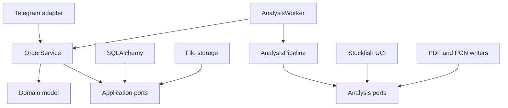
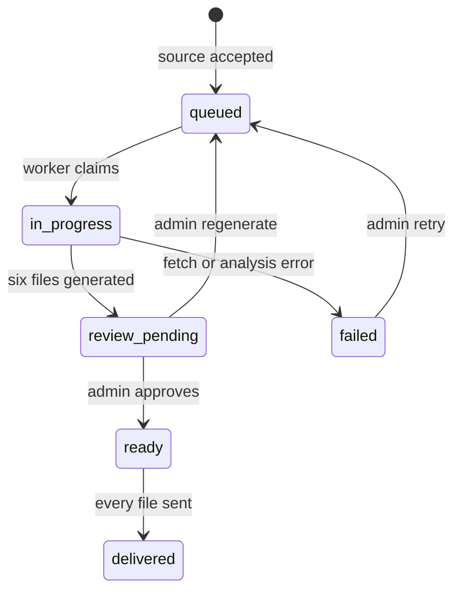

# Архитектура «Чест-досье»

## Решение

Проект остается модульным монолитом. При трех заказах в сутки микросервисы были бы не
архитектурой, а ритуальным размножением сетевого геморроя. Границы модулей при этом настоящие и
позволяют выносить тяжелые части без переписывания продукта.

### Domain

Не знает о Telegram, SQLAlchemy, Redis, путях, Lichess и Stockfish. Содержит заказ, платеж,
артефакт, журнал событий, типы результата и допустимые переходы.

### Application

`OrderService` — единственная точка изменения жизненного цикла заказа. Он оркестрирует оплату,
прием источника, очередь, автоматический анализ, ручную проверку, комплектацию и доставку.
`AnalysisWorker` получает зависимости через протоколы: источник партий, синхронный аналитический
runner, хранилище и notifier. Поэтому Telegram, HTTP и движок не смешаны в одном обработчике.

### Analysis core

`AnalysisPipeline` синхронен и не знает о БД, Telegram или фоновых задачах. На входе байты PGN и
точное имя игрока, на выходе типизированный `AnalysisResult` и шесть файлов. Движок, PDF и PGN-
writer подключены через отдельные порты. Тот же pipeline используется worker-ом и локальной CLI.

### Infrastructure

- SQLAlchemy + Unit of Work реализуют хранение заказов и аудит переходов;
- локальное SHA-256-хранилище делает атомарную запись и не позволяет выйти за корневой каталог;
- Lichess adapter ограничивает число и размер скачиваемых партий;
- Stockfish adapter говорит только по UCI и использует node limits, а не зависимые от машины часы;
- ReportLab и python-chess создают PDF и четыре независимых position-PGN.

### Presentation

Routers преобразуют Telegram Update в команды приложения. FSM хранит только незавершенную анкету;
бизнес-статус всегда находится в БД. Уведомления worker-а — отдельный Telegram adapter.

## Жизненный цикл автоматического дела

`review_pending` отделен от `in_progress`: по одной записи всегда видно, работает ли еще движок или
комплект уже ждет человека. Worker не назначает администратора и не имеет права перевести дело в
`ready` или `delivered`.

## Инварианты

- `public_id`, idempotency key, invoice payload и charge ID уникальны;
- оплата всегда проходит через `paid`, даже если сразу после этого нужен источник;
- решение — только ход исследуемого игрока; оценка нормализована к его цвету;
- исходные партии и учебные позиции дедуплицируются до формирования результата;
- fast pass покрывает весь корпус, deep pass перепроверяет ограниченный список после `Clear Hash`;
- автоматический комплект содержит schema-versioned JSON, PDF и четыре PGN;
- каждый учебный PGN содержит `SetUp`, `FEN` и `Orientation`; WHITE и BLACK не смешиваются;
- `review_pending` невозможен без полного и повторно провалидированного автокомплекта;
- `ready` невозможно без PDF и четырех PGN, а `delivered` — без отметки доставки каждого файла;
- результат может заменить и выдать только закрепленный администратор;
- повторная доставка продолжает с первого еще не отправленного файла;
- в production запрещены MemoryStorage, ручная оплата и автоматическое создание схемы.

## Процессная модель и рост

С SQLite bot polling и worker работают в одном процессе. Шахматный pipeline выполняется через
`asyncio.to_thread`, поэтому Telegram loop не блокируется. Один заказ анализируется за раз: это
согласовано с текущим лимитом мощности и исключает конкуренцию за CPU/hash.

Пути роста не требуют менять доменную модель:

1. PostgreSQL и атомарный claim/`SKIP LOCKED` перед вторым worker-ом.
2. S3-совместимое хранилище как новая реализация `FileStorage`.
3. Отдельный worker-процесс через очередь, сохранив команды `OrderService`.
4. Webhook или Mini App как новый presentation adapter.
5. Интерактивный тренажер поверх `analysis.json` и position-PGN.

До первого пункта несколько worker-ов или реплик на одной SQLite запрещены эксплуатационным
регламентом. Это явное ограничение, а не надежда на то, что гонка «как-нибудь не случится».
